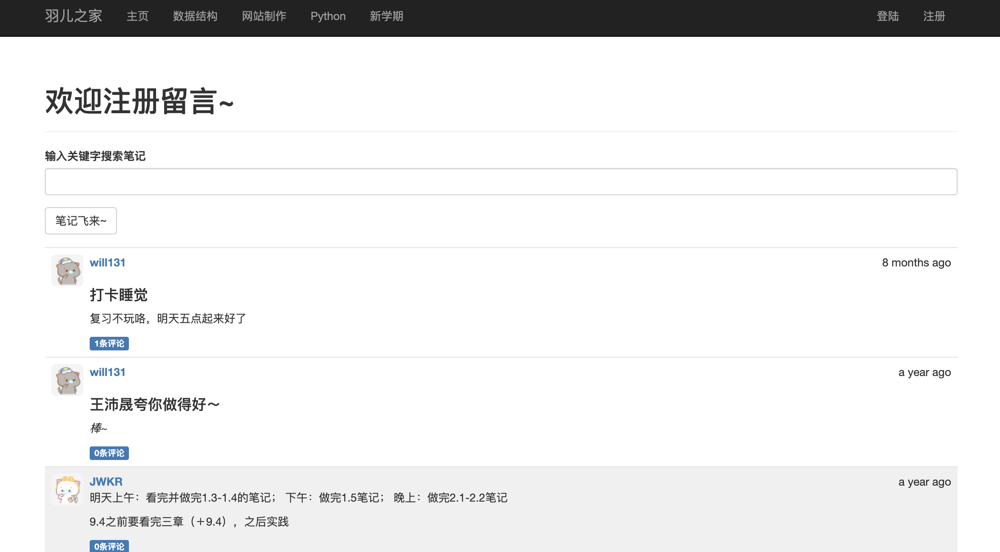
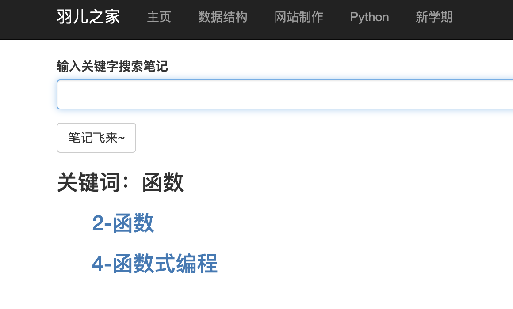
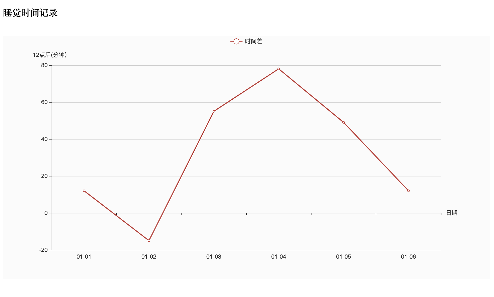
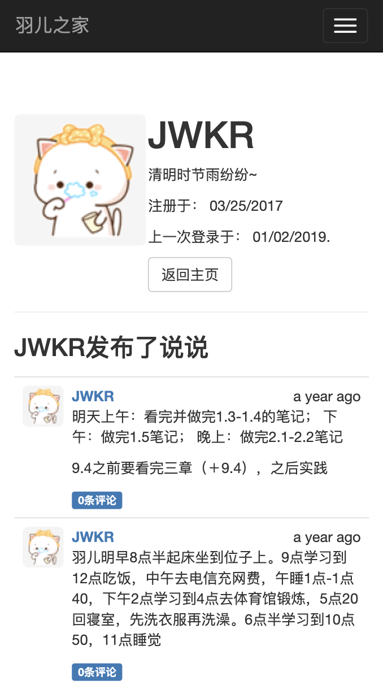

## 羽儿之家网站

本项目在转专业前完成第一版，做为个人主页运行在腾讯云上，后经几次修改，增加了若干功能。现在免费服务器已过期，在此保留源码。

### 项目功能

+ 日常记录
  + 笔记归纳整理存放
    + 分类整理笔记
    + 关键词搜索
  + 快捷上传
  + 支持markdown
+ 好友社交
  + 好友可直接注册
  + 互动交流讨论
  + 说说，日志，留言
+ 私人
  + 私人模式
  + 手机 APP 模式
  + 打卡睡觉

### 与原版的区别

[原项目](https://github.com/miguelgrinberg/flasky) Flask Web开发: 基于Python的Web应用开发实战

+ 减少功能
  + 注册时的邮箱验证
  + 用邮箱找回密码
+ 增加功能
  + 使用 MySQL 替代 SQLite
  + 笔记和笔记搜索（notebook/views.py)
  + 手机 APP 模式（base.html 的 js 部分)
  + 情侣私人模式（main/views.py)
  + 自定义头像（models）
  + 睡前打卡时间曲线（detail.html)
  
### 项目结构
与原项目一致

### 部分截图

在主页上可以看到根据笔记本自动生成的快捷入口

可以根据关键字对笔记进行搜索

根据打卡的时间，自动生成打卡时间的折线图

用 Hbuilder 打包成手机 APP

